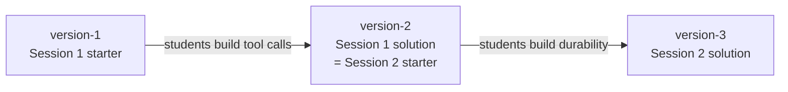

# Docs

Plain-English notes on **how the harness works and why**. They cover every concept we built, plus the technical questions asked along the way, with a diagram for each idea.

`Instructions/` tells you **what to do**, step by step. `docs/` explains **why it works**.

| Session | Topic | Concepts | Questions & answers |
|---|---|---|---|
| 1 | Tool calls | [version-1/concepts.md](version-1/concepts.md) | [version-1/questions.md](version-1/questions.md) |
| 2 | Durability | [version-2/concepts.md](version-2/concepts.md) | [version-2/questions.md](version-2/questions.md) |

## Branches and sessions

The diagrams are written in [Mermaid](https://mermaid.js.org/), and GitHub draws them automatically when you open a file.
