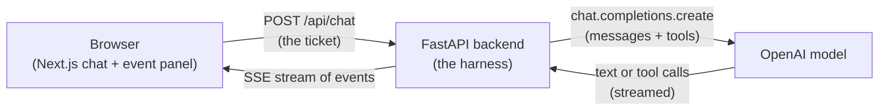
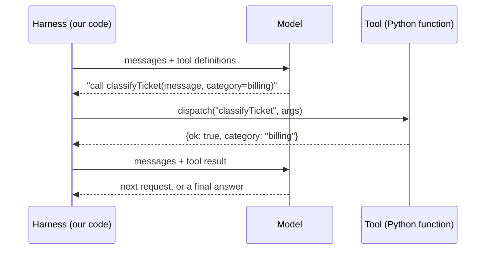
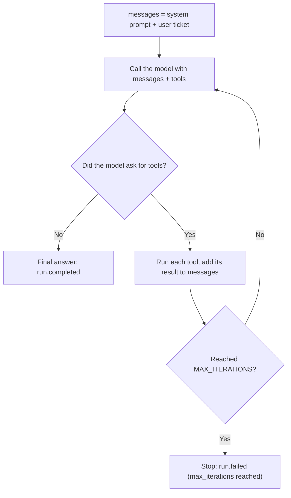
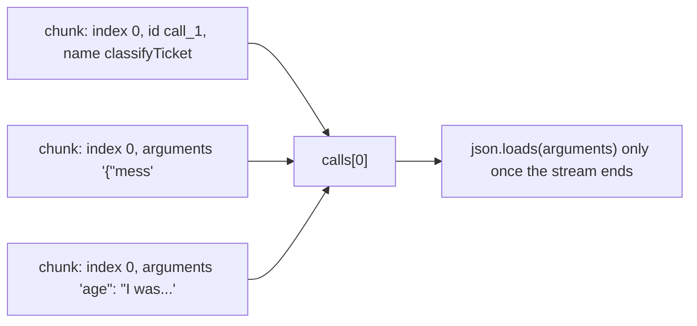
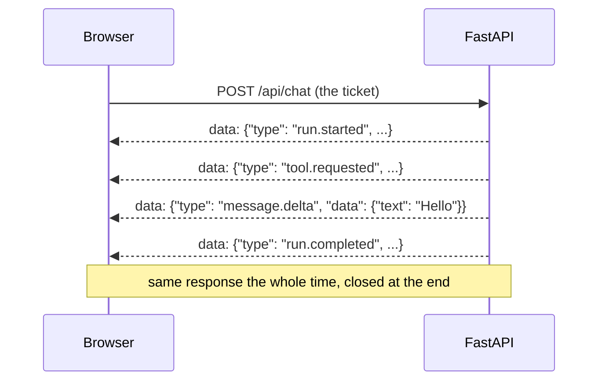

# Session 1: Tool calls (concepts)

In this session we build an **agent**: a program that reads a customer support ticket, asks an LLM what to do, runs the tools the LLM asks for, and repeats until the ticket is handled. Everything around the model (the loop, the tools, the events, the limits) is the **harness**.

---

## 1. The big picture

There are three parts: a **browser UI**, a **FastAPI backend**, and the **OpenAI model**.



**Example:** you type *"I was charged twice"*. The backend asks the model, the model says "call `classifyTicket`", the backend runs it, tells the model the result, and so on. Each of these moments is sent to the browser as an **event**, and that's what you see in the right-hand panel.

---

## 2. What a tool call really is

The model **never runs your code**. It can only reply with a request: *"please call `classifyTicket` with these arguments"*. Your harness decides whether and how to run it, then sends the result back.



A tool has **two halves**:

| Half | What it is | Where |
|---|---|---|
| **Definition** | A JSON Schema that tells the model the tool exists, what it's for and what arguments it takes | `TOOLS` in `backend/app/tools.py` |
| **Handler** | The Python function that actually runs | `classify_ticket()` and the others, found through `dispatch()` |

**Example definition (shortened):**
```json
{"name": "searchKnowledgeBase",
 "description": "Look up help articles for a ticket category. Call this after classifyTicket.",
 "parameters": {"category": {"enum": ["billing", "bug", "sales", "account"]}, "query": {"type": "string"}}}
```
The **description is a prompt**: "Call this after classifyTicket" really changes the order the model uses tools in. The **enum** stops the model from inventing a category.

---

## 3. The agent loop

An "agent" is just a loop. We write it by hand, and we don't use any SDK agent runner.



**Example run, with the double-charge ticket:**

| Iteration | Model asks for | Tool returns |
|---|---|---|
| 1 | `classifyTicket` | `{category: billing}` |
| 2 | `searchKnowledgeBase(billing)` | 3 billing articles |
| 3 | `draftReply(...)` | `{draftId: draft-1}` |
| 4 | `sendReply(draft-1)` | `{sentId: sent-1}` |
| 5 | Nothing: it writes a summary | the run is complete |

So a normal ticket takes **5 iterations**. One iteration is one model call, even if the model asks for several tools in that one call.

### The messages array is the model's memory
The model remembers nothing between calls. We send it the **whole conversation** every time:

```
[system]     You are a customer support agent...
[user]       I was charged twice
[assistant]  (tool call) classifyTicket {...}
[tool]       {"ok": true, "category": "billing"}
[assistant]  (tool call) searchKnowledgeBase {...}
[tool]       {"ok": true, "articles": [...]}
...
```
Rule: every assistant tool call **must** be followed by a `tool` message with the same `tool_call_id`, or the API rejects the next call.

---

## 4. Streaming, and stitching tool calls together

With `stream=True`, the model sends its reply in small **chunks** instead of all at once.

- **Text** chunks are sent straight to the UI as `message.delta` events, which is why the answer appears word by word.
- **Tool calls arrive in pieces.** The name comes first, then the arguments a few characters at a time. We join the pieces using the tool call's `index`.



**Example:** parsing `{"mess` on its own would crash. Join all the pieces first, then parse.

---

## 5. Events: how the UI knows what's happening

Every moment of a run becomes an **event** with the same shape: `{ id, ts, type, data }`.

| Event | When | What the UI does |
|---|---|---|
| `run.started` | Run begins | Logs it |
| `iteration.started` | Each model call | Logs `{iteration, max}` |
| `thinking` | Before and after waiting for the model | Shows or hides "Thinking…" |
| `message.delta` | Each text chunk | Appends the words to the answer |
| `tool.requested` | Model asked for a tool | Adds a tool card: **Running** |
| `tool.completed` | Tool returned | Card becomes **Completed** |
| `run.completed` / `run.failed` | Run ends | Logs it, and shows an error card on failure |

**The backend only emits events and the UI only draws them.** That's why we could swap the fake agent for the real one without touching the frontend.

---

## 6. SSE: how events travel to the browser

**Server-Sent Events** keep **one HTTP response open** and send messages down it one at a time.



On the wire it's plain text: one `data: {...}` line per event and a blank line between events. Our code: `to_sse()` in `backend/app/events.py` writes it, and `readSSE()` in `frontend/lib/use-agent-stream.ts` reads it.

---

## 7. Limits and status: the harness is in charge

- **Max iterations.** A model can loop forever by retrying or misreading a result. **We** cap it with `for iteration in range(1, max_iterations + 1)`. If the loop runs out, we emit `run.failed`. Example: with `MAX_ITERATIONS=2` the run stops after `searchKnowledgeBase`.
- **Thinking status.** There's a gap of about 1 second between sending a request and the first chunk. We emit `thinking: started` before the call and `thinking: stopped` on the first chunk, so the UI can show "Thinking…".

---

## 8. The prompt and the tool schemas are part of the harness

The model does what the harness tells it to. A prompt that says *"For every ticket: 1. classifyTicket…"* makes the model run all four tools even for "Hi". See [questions.md](questions.md#i-said-hi-but-why-does-a-tool-call-happen). Changing the prompt so greetings get a plain reply fixed it, with no code changes.
