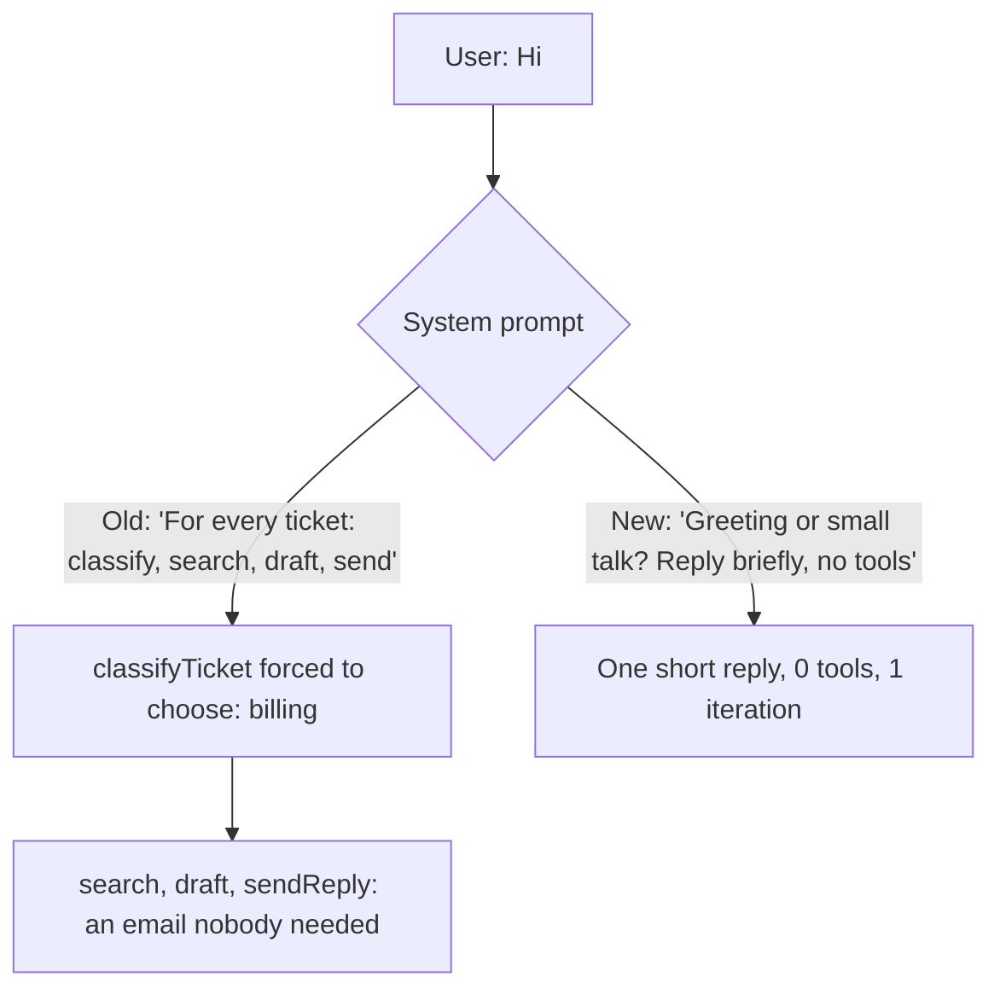
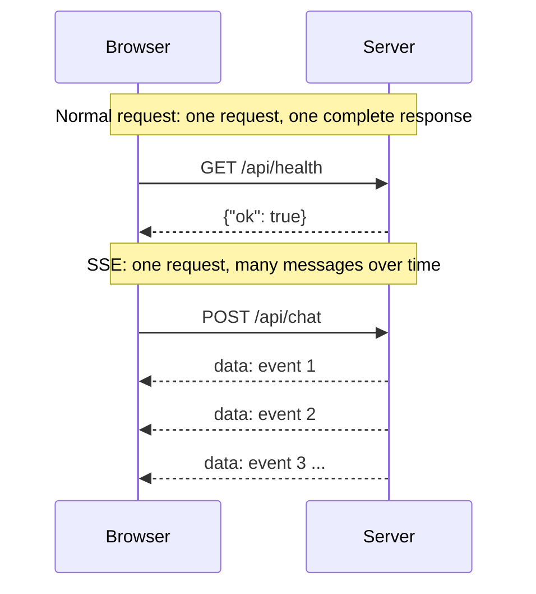

# Session 1: Questions & answers

Technical questions asked while building Session 1, answered in simple English.

---

## I said "Hi", but why does a tool call happen?

**Short answer:** the harness told the model to do it.

Two things made the model run all four tools for "Hi":

1. **The system prompt said "For every ticket: 1. classifyTicket, 2. …"** That gives the model no way to decide a message *isn't* a ticket, so it treats "Hi" as one.
2. **`classifyTicket`'s `category` has no "none of these" option.** It must be `billing`, `bug`, `sales` or `account`. Once the tool is called, the model is forced to pick one, so "Hi" became `billing`, and a billing email was drafted and sent.



**The fix**, in `backend/app/agent.py`:
```text
If the message is a greeting, small talk, or doesn't describe a support issue,
reply briefly and ask how you can help. Do not call any tools.

If it is a support ticket:
1. classifyTicket ...
```
**Result:** "Hi" → *"Hello! How can I assist you today?"* in 1 iteration with 0 tools.

**Lesson:** tools run only when the model decides to call them, and the **system prompt and the tool schemas** shape that decision. They're part of the harness, just like the loop.

---

## What is `itertools`?

A module in Python's **standard library**, so there's nothing to install. We use one function from it, `itertools.count`, as an ID counter:

```python
_draft_ids = itertools.count(1)
next(_draft_ids)  # 1
next(_draft_ids)  # 2
```

So `draftReply` returns `draft-1`, then `draft-2`, and so on. It's the same as keeping a `global` counter and adding 1 each time, just shorter. The count lives in memory, so it goes back to 1 when the backend restarts. That's fine, because the tools are stubs.

---

## What is SSE?

**Server-Sent Events**: a way for the server to keep **one HTTP response open** and send many messages down it as they happen.



**On the wire** it's plain text:
```
data: {"type": "run.started", "data": {"runId": "4e3dc375"}}

data: {"type": "message.delta", "data": {"text": "Hello"}}

```

**Compared with the alternatives:**

| | Direction | Good fit for us? |
|---|---|---|
| **SSE** | Server → browser | ✅ The agent talks and the browser watches. It's plain HTTP. |
| **WebSocket** | Both ways, all the time | More than we need. The browser only sends once, with the ticket. |
| **Polling** | Browser asks again and again | Works, but delayed and wasteful |

*(Asked during Session 2, but SSE is what Session 1 uses to stream events.)*
