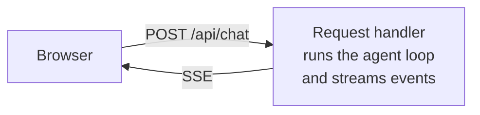
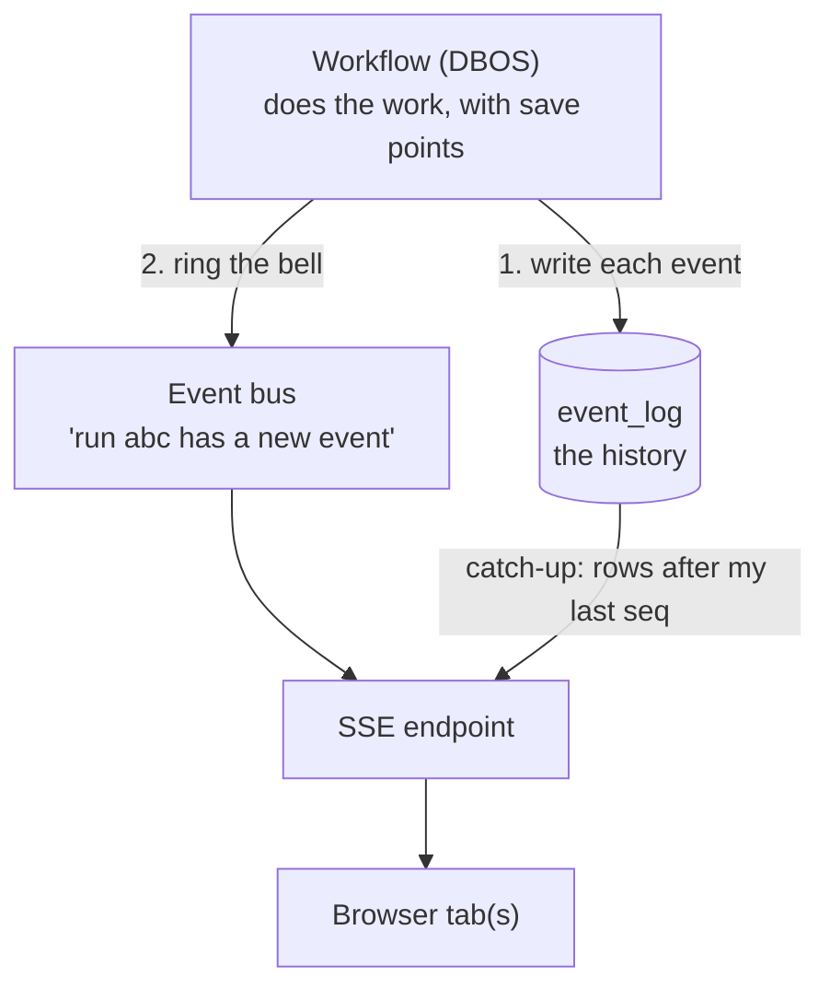
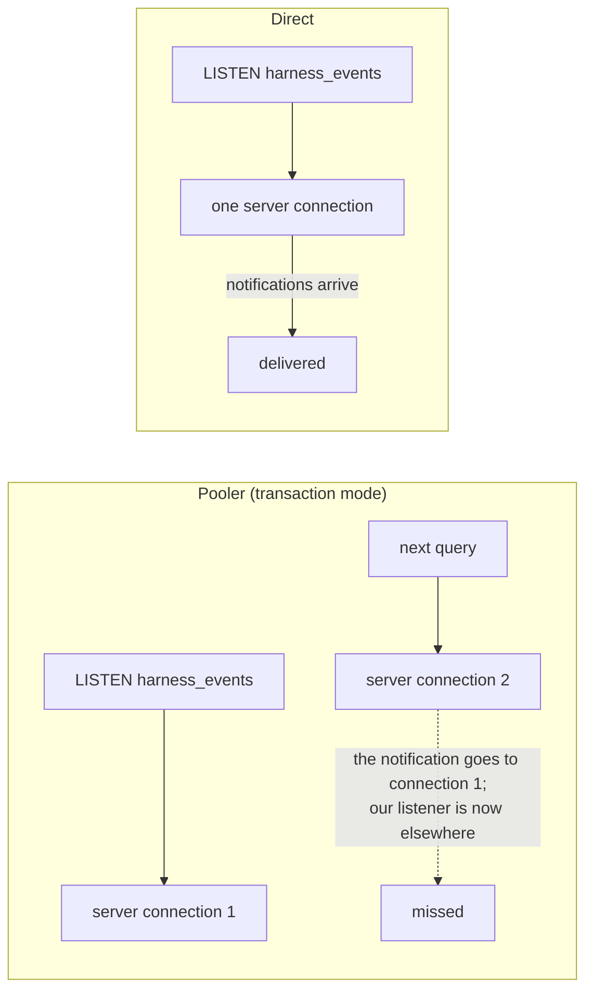
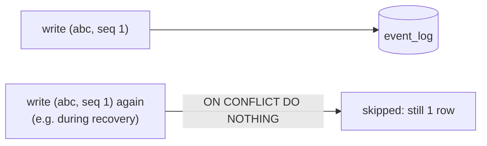
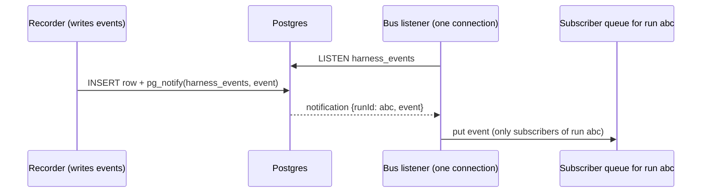
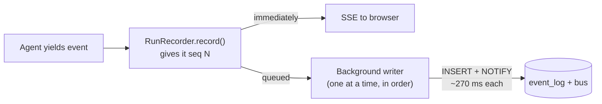
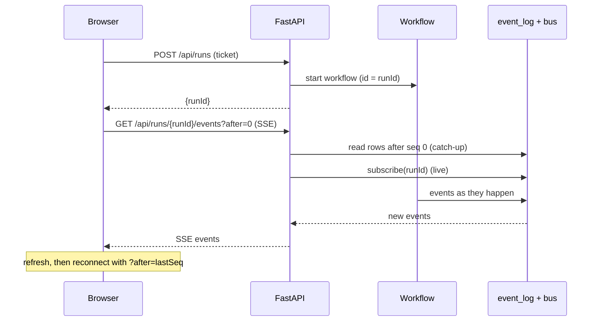
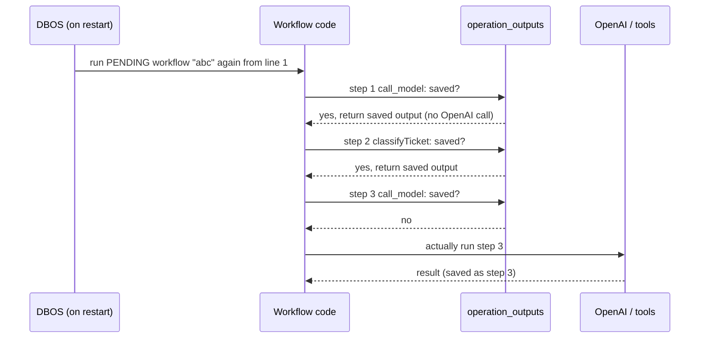
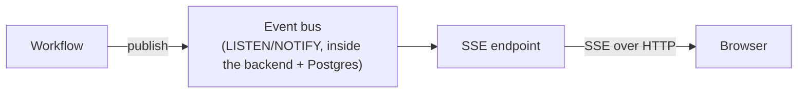

# Session 2: Durability (concepts)

**Durability** means a run **survives things going wrong**: a page refresh, a dropped connection, a server crash. It doesn't get lost, and finished work doesn't get done twice.

> **Status on `version-3`:** sections 1–8 are built (Postgres, `event_log`, event bus, recording events, the run/viewer split). Sections 9–10 (DBOS workflows and recovery) are **planned** and explained here ahead of time.

---

## 1. The problem with Session 1

In Session 1 the whole run lives **inside one HTTP request**.



| What happens | Result |
|---|---|
| You refresh mid-run | The run and its events are gone |
| The server restarts after `classifyTicket` | The run dies, and nobody knows whether `sendReply` ran |
| You open a second tab | It sees nothing |

**The run only exists while one browser is connected.** Durability fixes that with three pieces.

---

## 2. The three pieces



| Piece | Question it answers | Everyday comparison |
|---|---|---|
| **Workflow** | How does the run survive a crash? | A video game with **checkpoints** |
| **Event log** | What happened in this run? | A chat's **message history** |
| **Event bus** | Is there something new right now? | A **push notification** |

---

## 3. Postgres on Neon: use the direct host, not the pooler

Neon gives two connection strings:

```
ep-broad-cloud-xxx-pooler.c-6.us-east-2.aws.neon.tech   ← pooler (PgBouncer)
ep-broad-cloud-xxx.c-6.us-east-2.aws.neon.tech          ← direct
```

The **pooler** runs in *transaction mode*: each transaction may go to a **different** server connection. That's great for serverless code with hundreds of short connections. But it breaks anything that needs to **stay on one connection**, such as `LISTEN/NOTIFY`, which our event bus and DBOS rely on.



Our backend is a **long-running server** with a few connections, so it doesn't need pooling. **Use the direct host.**

---

## 4. The event log (`event_log` table)

Every event, except the word-by-word text, is stored as a row.

```sql
event_log(id, run_id, seq, type, data jsonb, created_at,  UNIQUE (run_id, seq))
```

**Example rows for one run:**

| run_id | seq | type | data |
|---|---|---|---|
| 5cbde085 | 1 | run.started | `{"runId": "5cbde085"}` |
| 5cbde085 | 2 | iteration.started | `{"iteration": 1, "max": 10}` |
| 5cbde085 | 5 | tool.requested | `{"name": "classifyTicket", ...}` |
| 5cbde085 | 25 | message.completed | `{"text": "I classified your issue..."}` |
| 5cbde085 | 26 | run.completed | `{"iterations": 5}` |

### Why `seq`? It numbers events so duplicates are impossible
- **`seq` is decided by our code**: the 1st event of a run is always 1, the 2nd always 2.
- **`UNIQUE (run_id, seq)`**: the database refuses a second row with the same pair.
- **`INSERT … ON CONFLICT DO NOTHING`**: a repeated write is skipped quietly.



Why not use `id` or `created_at`? Those are **generated by the database on each insert**, so a repeated write gets a *new* value and looks like a different event.

`seq` also gives us **order** within a run, and a **bookmark** for reconnecting: "send me everything after seq 7".

---

## 5. The event bus (Postgres `LISTEN/NOTIFY`)

The log is the history. The bus is the **doorbell** that tells listeners "run X just produced an event".



- **`publish(run_id, event)`** sends a `NOTIFY`.
- **`subscribe(run_id)`** gives you a queue of that run's events.
- **One listener connection** per server receives everything and passes each event only to the right run's subscribers.
- **It's fine to lose a notification**, because the log has everything. A reconnecting viewer catches up from `event_log`.
- **Notifications have an 8000-byte limit.** A bigger event is sent as a **pointer** `{seq, type}`, and the receiver loads the full row from `event_log`.
- **If a notification is sent inside a transaction that's rolled back, it's never delivered**, so the bus can't announce something that wasn't saved.

**Measured:** one publish-and-receive round trip takes about **275 ms**, the same as a plain query to Neon in us-east-2 from here. That's network distance, not bus overhead.

---

## 6. Recording events: one statement, in the background

Each stored event is written with **one SQL statement** that inserts the row and notifies the bus, but only if the row was really new:

```sql
WITH inserted AS (
  INSERT INTO event_log (...) VALUES (...)
  ON CONFLICT (run_id, seq) DO NOTHING
  RETURNING 1
)
SELECT pg_notify('harness_events', <event>) FROM inserted   -- 0 rows → no notification
```

A repeated event is therefore **neither stored nor announced twice**.



**Why in the background?** Each write takes about 270 ms. A run stores about 26 events, so waiting on each would add about 7 seconds. Instead the browser gets events instantly and the log catches up a moment later.

---

## 7. `message.delta` vs `message.completed`

| Event | Stored? | Why |
|---|---|---|
| `message.delta` (each few words) | ❌ live only | ~50 tiny rows per answer, and a retried model call produces **different** words, so they can't be deduplicated by `seq` |
| `message.completed` (the full text) | ✅ stored once | Emitted after the model finishes. A reconnecting browser gets the whole answer from this. |

---

## 8. Splitting the run from the viewer

The current `POST /api/chat` both **starts** a run and **streams** it. It will become two endpoints:



Now the run **doesn't belong to any request**. Close the tab and it keeps going. Open it again and you catch up.

### Details that make it work
- **The browser picks the `runId`.** If the same `POST /api/runs` arrives twice, for example after a double click or a retried request, the second one returns `started: false` and nothing runs twice. DBOS uses the same idea later, with a workflow ID.
- **Subscribe first, then read the log.** Anything committed after the read is already waiting in the subscription, so nothing falls into the gap between catch-up and live. Events that turn up in both places are skipped by `seq`.
- **Refresh rebuilds the screen from the log.** The last `runId` is kept in the browser. `run.started` carries the user's message (`input`), so even the chat bubble comes back.
- **Live words arrive in batches.** While one database round trip is in flight, new `message.delta`s pile up and are sent as one merged notification. When `message.completed` arrives, its full stored text replaces whatever words were shown live.
- **Gotcha we hit: never let a request cancel a query on a shared connection.** A browser refresh cancelled a catch-up query halfway through. That left the shared database connection stuck ("another command is already in progress"), and every later write failed. The fix: reads are **shielded**, so they always finish, and a broken connection is reset and retried.

---

## 9. Workflows with DBOS (planned)

A **workflow** is our agent loop, with a **checkpoint after every step**.

| DBOS term | Meaning | In our harness |
|---|---|---|
| `@DBOS.workflow()` | The orchestrator. DBOS records its inputs and status. | The agent loop |
| `@DBOS.step()` | A unit of work whose **output is saved** when it finishes | One model call, or one tool call |

### DBOS has its own tables, separate from `event_log`

| Table (schema `dbos`) | Holds |
|---|---|
| `workflow_status` | One row per run: `PENDING`, `SUCCESS` or `ERROR` |
| `workflow_input` | The arguments the workflow started with: the user's messages |
| `operation_outputs` | One row per **finished step**: `function_id` (1st, 2nd, 3rd step…) and its `output` |

DBOS **never reads `event_log`**. Its tables are for **DBOS, to resume**. `event_log` is for **people and the UI, to see what happened**.

### Recovery: what happens after a crash



**Finished steps are walked through again but not repeated.** It's like fast-forwarding a recording to where it stopped, then going live.

### The messages array is rebuilt, not stored
DBOS stores the **pieces**: the workflow's inputs and each step's output. On recovery the same code appends the same saved outputs in the same order, so `messages` ends up **exactly** as it was before the crash.

```
messages = [system, user ticket]          ← workflow_input
+ assistant msg from saved step 1         ← operation_outputs
+ tool msg from saved step 2              ← operation_outputs
+ assistant msg from saved step 3         ← operation_outputs
→ next model call uses the rebuilt array
```

### Two rules this creates
1. **The workflow code must make the same choices every time.** DBOS matches saved results by **position** (1st step, 2nd step…). No `random`, `time` or `uuid4()` directly in the workflow body. Put them in a step, or use `DBOS.workflow_id`.
2. **Steps can run more than once.** If the server crashes after a step did its work but before its result was saved, the step runs **again**. That's harmless for `classifyTicket`, but dangerous for `sendReply`, which could send the email twice. Real side effects need an **idempotency key**, for example `workflow_id:tool_call_id`.

---

## 10. Two meanings of "replay": recovery vs catch-up

| | **Recovery** (DBOS) | **Catch-up** (our event log) |
|---|---|---|
| When | Server restarts with an unfinished run | Browser opens or refreshes |
| Reads | `dbos.operation_outputs` | `event_log` |
| What happens | Our workflow code runs again, and finished steps are skipped | Old event rows are sent to the browser |
| Purpose | **Finish the work** without redoing it | **Show the work** without losing it |

They meet in one place: during recovery our code emits its events again, and `seq` + `ON CONFLICT DO NOTHING` turns those repeats into no-ops.

---

## 11. Where each technology sits



- **The bus** connects backend code to backend code, through Postgres.
- **SSE** connects the backend to the browser.
- The browser **never talks to the bus**.
- **WebSocket isn't needed:** the browser only *sends* the ticket, and an ordinary POST handles that. A later "approve this reply" button can also be a POST.
