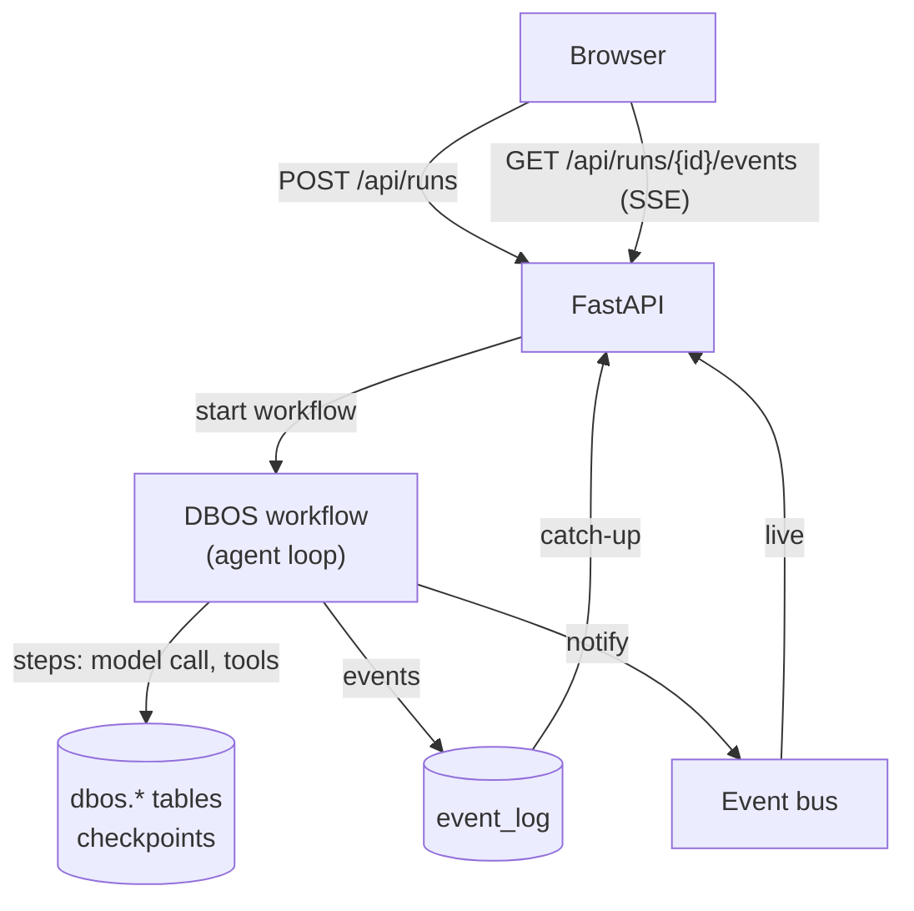
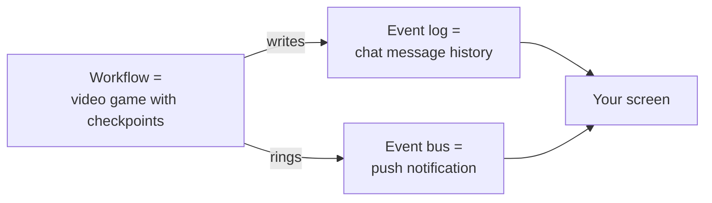
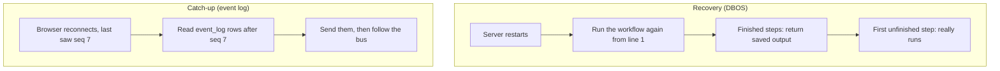
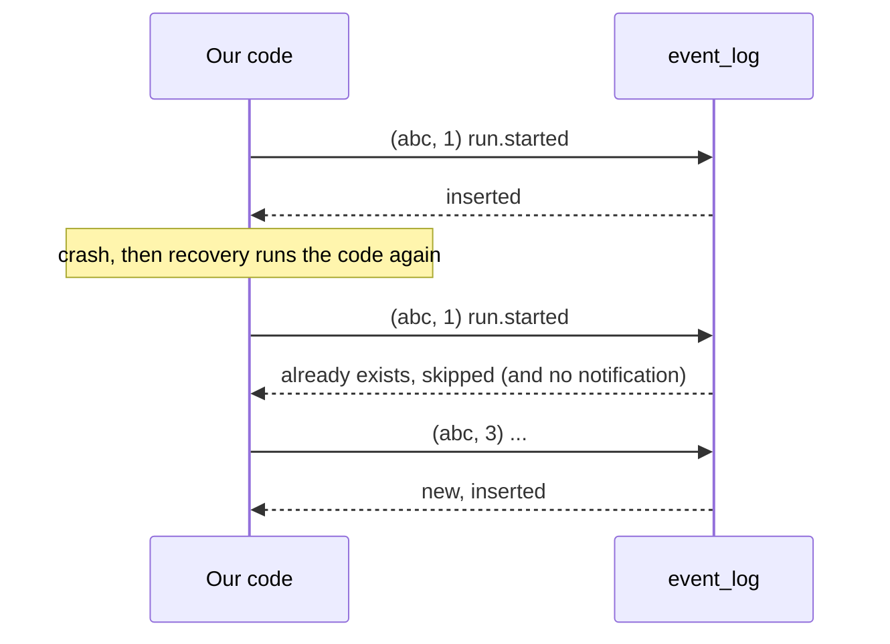
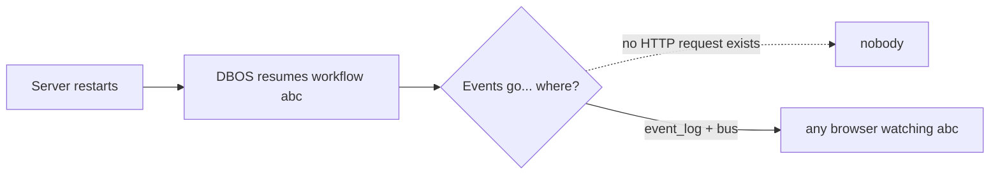
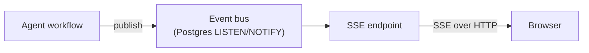

# Session 2: Questions & answers

Technical questions asked while designing and building durability, in the order they came up.

---

## 1. How do we create a workflow and log events with Postgres and DBOS? What does the system look like?

The run moves **out of the HTTP request** and into a **DBOS workflow**. Every event is **stored in Postgres** (`event_log`), and the browser **watches** the run instead of running it.



**Example:** you send a ticket and get back `runId: abc`. The workflow runs on its own. Your browser opens the event stream for `abc`. If the server crashes after `classifyTicket`, DBOS resumes `abc` at the next step on restart, and your browser reconnects and catches up from `event_log`.

See [concepts.md](concepts.md) sections 2, 8 and 9 for the full explanation.

---

## 2. Do we need an event bus? If so, why?

**Not while the run lives inside the request. Yes once it doesn't.**

- **Session 1:** the agent `yield`s events straight into the one HTTP response. The producer and the only consumer are the same piece of code, so there's nothing to connect.
- **Durable:** the run is separate from any request. Viewers come and go: a refresh, a second tab, a browser that opens halfway through. Something has to tell each one "event 17 just happened". That's the bus.

| | `event_log` | Event bus |
|---|---|---|
| Role | History | Notification |
| Durable? | Yes | No, fine to lose |
| Example | "Show me everything since seq 7" | "Run abc has something new" |

**Options:** polling the table (no bus), Postgres `LISTEN/NOTIFY` (chosen), or an in-process `asyncio` pub/sub (single server only).

---

## 3. We don't want to use `-pooler`, right?

**Right.** Neon's `-pooler` host is PgBouncer in **transaction mode**: each transaction can land on a different server connection. That breaks `LISTEN/NOTIFY` (the event bus, and DBOS) and other features that depend on one session. Our backend is a long-running server with a few connections, so pooling isn't needed anyway.

**Fix:** remove `-pooler` from the hostname. Nothing else changes.
```
ep-broad-cloud-b4alg2zi-pooler.c-6...   →   ep-broad-cloud-b4alg2zi.c-6...
```

---

## 4. I still don't understand the event bus and workflow concepts

Think of three everyday things:



- **Workflow:** the agent loop, with a **save point after every step**. If the game crashes, you restart from the last checkpoint instead of level 1. After a server crash, DBOS skips finished steps and continues.
- **Event log:** like a chat's **history**, it's still there tomorrow. Refresh the page and you scroll back through it.
- **Event bus:** like a **push notification**: "new message!". If you miss it, nothing is lost, because the history has it.

**The whole story with a crash:**
1. You send a ticket. The workflow starts, and your browser shows events as the bell rings.
2. After `classifyTicket`, the server crashes. Your connection drops.
3. The server restarts. DBOS resumes the workflow and **skips** the finished steps.
4. Your browser reconnects: "I last saw seq 3". It reads 4+ from the log, then listens to the bell again.
5. The run finishes. Nothing was repeated and nothing was lost.

---

## 5. DBOS keeps its own tables and won't use `event_log`, right? And what does "replaying events" mean?

**Correct, they're separate.** DBOS writes to its own `dbos` schema:

| DBOS table | Holds |
|---|---|
| `workflow_status` | One row per run, with its status (`PENDING`, `SUCCESS`, `ERROR`) |
| `operation_outputs` | One row per finished step: `function_id` (1st, 2nd, 3rd…) and `output` |

DBOS reads these **to resume**. `event_log` is ours, read by the UI and by people **to see what happened**. Neither depends on the other.

**"Replay" means two different things, so we use two words:**



- **Recovery** re-runs *code* (finished steps are skipped). Its purpose is to **finish the work**.
- **Catch-up** re-sends *stored rows*. Nothing re-runs. Its purpose is to **show the work**.

**Where they meet:** during recovery our code emits events again. Because `seq` is deterministic and `(run_id, seq)` is unique, those repeats are skipped.

---

## 6. So the messages array we send to the LLM is the `output` column in `operation_outputs`?

**Not quite.** The array is **never stored as a whole**. DBOS stores the **pieces**, and the code rebuilds the array.

| Stored where | What |
|---|---|
| `dbos.workflow_input` | The starting messages (the user's ticket) |
| `dbos.operation_outputs.output` | **One step's** return value: one model reply, **or** one tool result |

**Example rows:**

| function_id | function_name | output |
|---|---|---|
| 1 | call_model | `{tool_calls: [classifyTicket …]}` |
| 2 | run_tool | `{ok: true, category: "billing"}` |
| 3 | call_model | `{tool_calls: [searchKnowledgeBase …]}` |

**On recovery:**
```
messages = [system, ticket]               ← workflow_input
call_model  → saved output 1 → append assistant message
run_tool    → saved output 2 → append tool message
call_model  → saved output 3 → append assistant message
next step   → nothing saved  → REAL call, with the rebuilt array
```

**Inputs + saved step outputs + deterministic code = the same messages array.** This avoids storing the whole conversation again at every step, and it's why the workflow code must behave the same way every time.

---

## 7. We want to make sure an event isn't duplicated. Is that why we have the `seq` column?

**Yes, but `seq` works together with two other things:**

1. **`seq` is deterministic**: the same event always gets the same number.
2. **`UNIQUE (run_id, seq)`**: the database refuses a second row with the same pair.
3. **`ON CONFLICT DO NOTHING`**: a repeated write is skipped quietly. In our single statement, the bus notification is skipped too.



**Why not `id` or `created_at`?** The database generates those on each insert, so a repeat gets a *new* value and can't be recognized as the same event.

**`seq` also gives** ordering within a run, and the catch-up bookmark (`?after=7`).

**Catch:** this only works if the workflow is deterministic. That's also why `message.delta` isn't stored: a retried model call produces different words.

**Tested:** writing `(run, seq 1)` a second time stored nothing, sent 0 notifications, and kept the original data.

---

## 8. Without the bus we're already streaming events to the UI, right?

**Yes, and for Session 1's design the bus isn't needed.** The run lives inside `POST /api/chat` and hands each event directly to that one browser.

The bus becomes necessary **when the run no longer belongs to the request**. Consider recovery:



DBOS resumes the run **on startup, not from any request**, so there's no response to write into. Something has to connect "the code producing events" with "whoever is watching now". That's the bus. Without it, the fallback is polling `event_log`.

**The bus is the price of separating the run from the request**, and that separation is what makes the run durable.

---

## 9. What is SSE?

See [Session 1 questions](../version-1/questions.md#what-is-sse). In short, it's one HTTP response kept open, with the server sending messages down it as they happen.

---

## 10. Even with the event bus, are we using SSE or WebSocket?

**Still SSE.** They aren't alternatives. They work on **different stretches** of the path:



| Stretch | Carried by | Between |
|---|---|---|
| Agent → SSE endpoint | **Event bus** | Backend ↔ backend, through Postgres |
| SSE endpoint → browser | **SSE** | Backend ↔ browser |

The browser **never talks to the bus**. It opens one SSE connection, and the endpoint (1) sends missed rows from `event_log` and then (2) forwards new events from the bus. WebSocket only helps if the browser has to keep sending during a run, and even an "approve this reply" button can be a plain POST.
